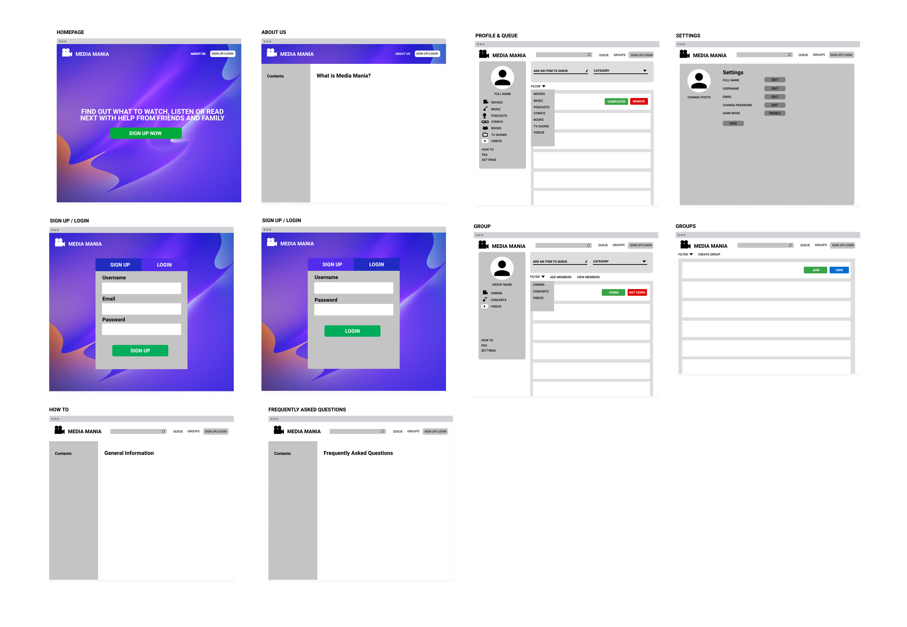
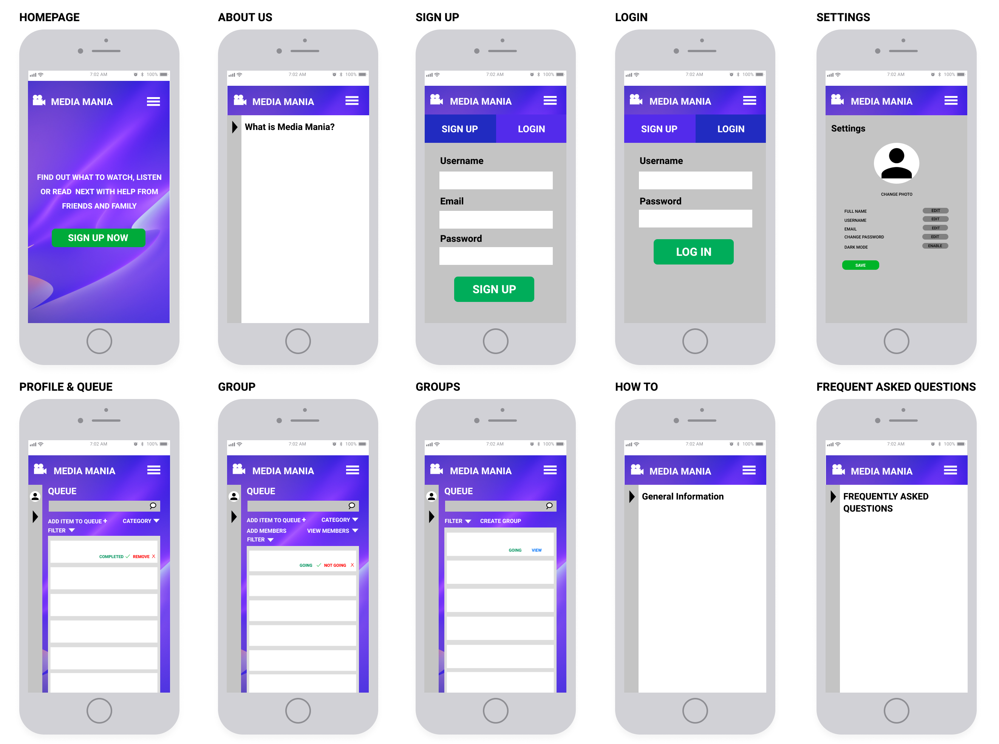

# Media Mania

Media Mania is a web application for making suggestions to friends and family on what to watch, read and listen to next in their spare time. Media Mania's goal is to reduce choice paralysis by giving users suggestions and fewer choices on what media to consume next in a structured queue where friends or family can add something to your queue and you can follow queue one by one or you can filter down choices based on the media that you want to consume in your free time. Users can create groups among set of specific friends or family members that have the same interests for going to cinemas or concerts. On daily basis all users on any platform may that be mobile, tablet or PC are overwhelmend by choice on what media to consume which causes choice paralysis make your life easier by getting suggestions from people that you trust!

## Table of contents

[UX (User Experience)](#UX)

[Features](#features)

[Technologies Used](#technologies)

[Testing](#testing)

[Deployment](#deployment)

[Known Bugs](#bugs)

[Credits](#credits)

## UX (User Experience)

### User Stories

As a first time visitor I want...
* To learn more from about us page on what the Media Mania application can do and what benefit will I get from using the web application.
* To sign up for an account quickly with Media Mania to start using the web application as soon as possible.
* The ability to use web application on mobile, tablet and desktop and to get famaliar with logging into Media Mania to use the web application on regular basis.
* To find other friends and family on the platform to add media suggestions to their queue.
* To create a group and add friends or family members to group for specific cinema and concert events.
* To enable dark mode in the settings when using the application at night and to reduce brightness from the screen.

As a returning visitor I want...
* To view my media queue for new suggestions from friends and family members.
* To view my group pages for any new suggestions on cinema or concert nights with friends and family members.
* To cross off media suggestions in my queue that I've completed recently.
* To add new media suggestions to friends and family members queues.
* To search for friends and family members that have recently signed up to Media Mania.
* To have the ability to update my username, email address, full name or password in the settings at any time including updating my profile picture or disabling dark mode.

### Wireframes
#### Desktop Wireframe

#### Mobile Wireframe

<a href="static/img/wireframes/tablet.png">Tablet wireframe</a>

## Features

Every webpage has an easy navigation with consistent design and color scheme through out the site to ensure that users can get their new media suggestions quickly.

### Homepage

The homepage has large hero image with the brand name and logo for media mania in left hand corner and on right hand corner we have links for about us page also the ability to either log in or sign up to using Media mania application. Users will get quick one liner to give them an idea of what application is all about and call to action button to sign up quickly.

### About Us

The about us page goal will be to persuade the user to sign up and show the benefits of using the application. It will show queue and group features off giving the user a quick walkthrough on how application works and what they can achieve with their media suggestions and how they can help other friends and family members using the web application.

### Sign Up / Login

The sign up and login page will give new users and regulars users a quick way of signing up for application and logging into the application. Sign up form only requires three fields username, email address and password. Then regular users only need sign in with their username and password.

### Search Feature

The search feature is on the profile, group and groups pages. Users can search for other users and other groups from the search to make suggestions or to join other groups.

### User Profile & Queue Feature

The profile page will contain the user's full name, profile picture and statistics on types of media they've completed so far to show progression to other users and main user. On the profile page main feature is the queue feature where other users can make new suggestions and choose media category to add to user's profile page from there the user can see the latest suggestions from other users by looking at timestamp once they've completed a suggestion they can click on the completed button which will add stat to their statistics in the profile container. If they tried out suggestion but didn't like it they can remove suggestion from the queue which will not add to statistics.

### Groups

The groups page will display all the groups that have been created by others users if you have specific name for the group that user is looking to join they can search for the group using the search feature. On the group page users will see cinema and concert suggestions from users of that group they can either use the call to action buttons to say their going or not going to an event to alert event organiser also the user can make suggestions to group as well.

## Technologies Used

### Languagues Used

- HTML
- CSS
- JavaScript
- Python

### Frameworks and Programs Used

- [Visual Studio Code](https://code.visualstudio.com/) - The developer used Visual Studio Code for their IDE to build the website.
- [Flask](https://flask.palletsprojects.com/en/2.0.x/) - Flask was used to create web application.
- [MongoDB Atlas](https://www.mongodb.com/) - MongoDB Atlas was used to store the application.
- [Google Fonts](https://fonts.google.com/) - Google Fonts was was used to style text of the website.
- [Google Cpweb Encoder](https://developers.google.com/speed/webp/docs/cwebp) - Google cpweb encoder was used to convert JPEG and PNG images to webp format to improve website performance.
- [Git](https://git-scm.com/) - Git was used in Visual Studio Code IDE for version control to commit and push to GitHub.
- [Gitmoji](https://gitmoji.dev/) - Gitmoji was used to create more meaningful and clearer commit messages.
- [GitHub](https://github.com/) - GitHub was used to store the website.
- [Heroku](https://www.heroku.com/home) - Website was deployed to Heroku.
- [Figma](https://www.figma.com/) - Figma was used to create designs for the wireframes, media mania camera logo and github banner.

## Testing

- [W3C Markup Validation Service](https://validator.w3.org/) - W3C Markup tool was to validate and ensure no syntax errors in HTML for website pages.
- [W3C CSS Validation Service](https://jigsaw.w3.org/css-validator/) - W3C CSS Validation tool was used to validate and ensure no syntax errors in the CSS stylesheet.
- [WebAIM Constrast Checker](https://webaim.org/resources/contrastchecker/) - WebAIM Constrast Checker tool was used to ensure contrast between foreground and background colors meets accessibility guidelines.
- [WAVE Web Accessibility Evaluation Tool](https://wave.webaim.org/) - This tool was used to ensure that web content on the website was more accessible to individuals with disabilities and meet accessibility guidelines.
- [Can I Use...](https://caniuse.com/) - It was used to check what techologies were supported in different web browser versions.
